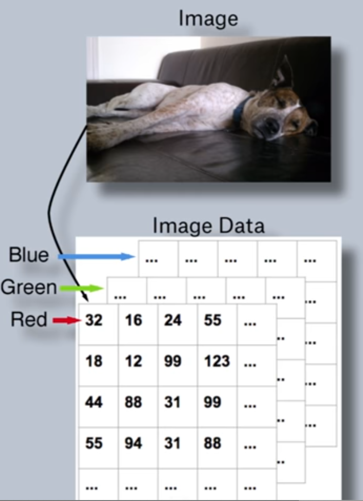
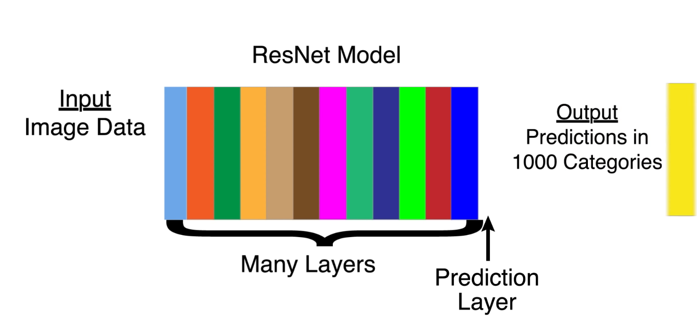

# Machine Learning Notes

## Kaggle Introduction
From [here](https://www.kaggle.com/learn/intro-to-machine-learning)  

The target value that you want to find out is called `y`.  
The input value(s) are called `X`.  
To figure out `X` you decide which features of the dataset could be interesting to predict the value that you want. (Door color is not correlated with housing price, number of rooms is)
```python
# Path of the file to read. We changed the directory structure to simplify submitting to a competition
iowa_file_path = '../input/train.csv'

home_data = pd.read_csv(iowa_file_path)
# Create target object and call it y
y = home_data.SalePrice
# Create X
features = ['LotArea', 'YearBuilt', '1stFlrSF', '2ndFlrSF', 'FullBath', 'BedroomAbvGr', 'TotRmsAbvGrd']
X = home_data[features]
```

Split the training data into chunks, 1 chunk that is the training set, the other that we'll test the data on.
```python
# Split into validation and training data
train_X, val_X, train_y, val_y = train_test_split(X, y, random_state=1)
```
`random_state` is the seed for the pseudorandom generator.

A simple model is a `DecisionTreeRegressor`. It creates an abstract tree which contains the features, the depth of the tree can be controlled and is a big factor on how accurate the predictions are gonna be. Too deep and we're _overfitting_ too shallow and we're _underfitting_. Depending on the depth, more or less entries are in the leaves. An example of _overfitting_ is, that there is only 1 example for a decision tree leaf.


The goal is always to find the sweet spot between _overfitting_ and _underfitting_:  

```python
# Specify Model
iowa_model = DecisionTreeRegressor(random_state=1)
# Fit Model
iowa_model.fit(train_X, train_y)
```
To figure out the if we're _over-_ or _underfitting_ we can calculate the _mean absolute error_
```python
# Make validation predictions and calculate mean absolute error
val_predictions = iowa_model.predict(val_X)
val_mae = mean_absolute_error(val_predictions, val_y)
```
Explore using different `max_leaf_nodes`(affects the depth) and choose the best size. If you find it you can use it to get better predictions:
```python
iowa_model = DecisionTreeRegressor(max_leaf_nodes=100, random_state=1)
iowa_model.fit(train_X, train_y)
val_predictions = iowa_model.predict(val_X)
val_mae = mean_absolute_error(val_predictions, val_y)
```

There are also other models like `RandomForestRegressor`, `DecisionTreeRegressor` is actually quite outdated.

## Deep Learning
|Expression|Description|
|----------|-----------|
|Tensor|Matrix with `n` dimensions |
|Convolution / Filter|Small tensor, that can be multiplied over a small section of the main image. Multiply it with the values in the matrix in the area that you want to check. High values=more likely that what you're searching|

About the size of convolutions:  
```
While any one convolution measures only a single pattern, there are more possible convolutions that can be created with large sizes. So there are also more patterns that can be captured with large convolutions.

For example, it's possible to create a 3x3 convolution that filters for bright pixels with a dark one in the middle. There is no configuration of a 2x2 convolution that would capture this.

On the other hand, anything that can be captured by a 2x2 convolution could also be captured by a 3x3 convolution.

Does this mean powerful models require extremely large convolutions? Not necessarily. In the next lesson, you will see how deep learning models put together many convolutions to capture complex patterns... including patterns to complex to be captured by any single convolution.
```
https://www.kaggle.com/dansbecker/building-models-from-convolutions

## Transfer Learning
Neural nets are bases on increasingly complex layers. The first layer will look for simple shapes, the next for more complex ones and so on. The last layer will produce the predictions. With transfer learning we can modify the last layer, without needing to recreate all the other ones.

The last layer before the prediction layer is a 1 dimensional tensor (vector)